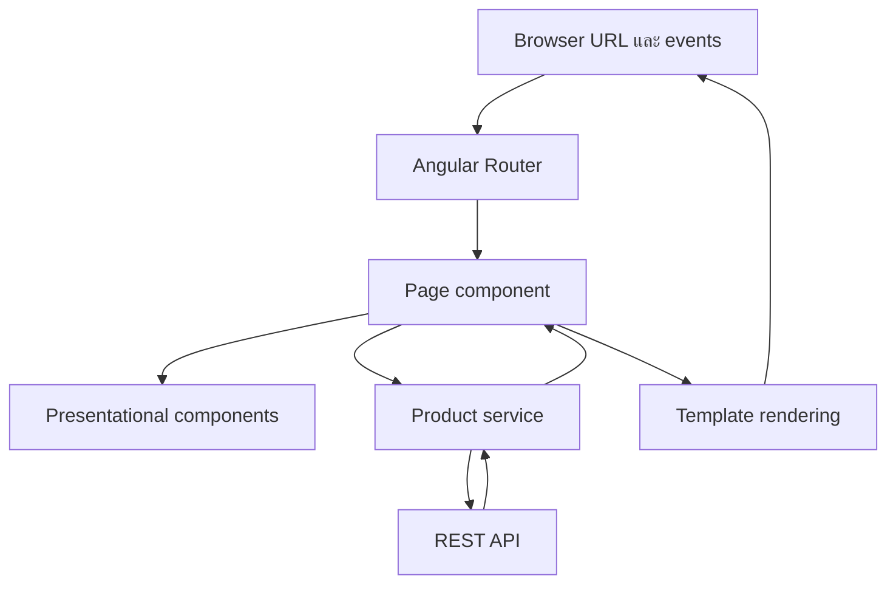

Angular ไม่ได้เป็นเพียงเครื่องมือเขียน HTML ให้สั้นลง แต่เป็น framework ที่กำหนดวิธีแบ่งหน้าจอ จัดการข้อมูล นำทาง และประกอบ dependency เข้าด้วยกัน บทนี้จึงสร้างแผนที่ความคิดก่อนเริ่มใช้ Angular CLI ในบทถัดไป

## เป้าหมายของบท

เมื่อจบบท คุณจะมอง Product Catalog เป็นส่วนย่อยที่มีหน้าที่ชัดเจน อธิบายเส้นทางข้อมูลจากผู้ใช้ไปยัง UI ได้ และรู้ว่าแนวคิดใดมีไว้แก้ปัญหาอะไร

บทนี้เป็นบทแนวคิดจึงยังไม่สร้างหรือแก้ไฟล์ใด

## สิ่งที่ต้องพร้อม

- อ่าน TypeScript class, function และ object ได้
- เข้าใจ HTML element และ browser event เช่น `click` หรือ `submit`
- แยกข้อมูลที่อยู่ในหน่วยความจำออกจากข้อมูลที่มาจาก server ได้

## หน้าเว็บแบบเดิมกับ SPA ต่างกันอย่างไร

การนำทางแบบ document navigation ขอ HTML document ใหม่จาก server แล้ว browser แทนที่หน้าปัจจุบันทั้งหมด ส่วน Single-Page Application หรือ SPA โหลด application shell แล้วให้ JavaScript เปลี่ยนส่วนของหน้าจอและ URL ตามการนำทาง

SPA ไม่ได้แปลว่ามี URL เดียว Product Catalog ยังมี URL เช่น `/products` และ `/products/42` ความต่างคือ Angular Router ประสาน URL กับหน้าจอโดยไม่ต้องโหลด application shell ใหม่ทุกครั้ง

Angular รับผิดชอบฝั่ง browser เท่านั้น REST API ยังคงเป็นผู้ตัดสินความถูกต้องของข้อมูลและบันทึกข้อมูลถาวร การตรวจ form ใน browser ช่วยผู้ใช้ แต่ไม่ใช่มาตรการความปลอดภัยแทน server

## แผนที่ของ Product Catalog

ภาพนี้ยังไม่ใช่โค้ด แต่เป็นขอบเขตความรับผิดชอบที่เราจะค่อย ๆ สร้างตลอดเล่ม

## หน้าที่ของ building blocks

| ส่วน | หน้าที่หลัก | ไม่ควรรับผิดชอบ |
| --- | --- | --- |
| Component | เป็นเจ้าของพฤติกรรมและ state ของ UI ส่วนหนึ่ง | รวมทุกหน้าของแอปไว้ใน class เดียว |
| Template | อธิบายสิ่งที่ต้อง render และเชื่อม event กับ component | ติดต่อ API หรือแก้ domain data โดยตรง |
| Service | รวมพฤติกรรมหรือ dependency ที่หลายส่วนต้องใช้ | กลายเป็นที่ทิ้ง state ทุกชนิดของแอป |
| Router | จับคู่ URL กับหน้าจอและจัดการ navigation | เก็บข้อมูลสินค้าที่มาจาก API |
| Dependency injection | สร้างและส่ง dependency ตามขอบเขตที่กำหนด | ซ่อน dependency จนตามที่มาไม่ได้ |

### Component และ template ทำงานเป็นคู่

Component class ให้ข้อมูลและพฤติกรรม ส่วน template ระบุว่าจะนำข้อมูลไปแสดงอย่างไร ตัวอย่างเช่น Product Card รับข้อมูลสินค้าจาก parent และส่ง event กลับเมื่อผู้ใช้เลือกคำสั่ง แต่ไม่ควรตัดสินใจเองว่าจะเปลี่ยน URL หรือเรียก API ใด

แนวทางนี้ทำให้ data flow อ่านได้จากบนลงล่าง: parent ส่งข้อมูลลงผ่าน input และ child ส่งเหตุการณ์ขึ้นผ่าน output เราจะลงมือสร้าง contract นี้ในบทที่ 7

### Service ไม่ได้แปลว่า global state

Service คือ class ที่ Angular สามารถสร้างและส่งให้ผู้ใช้ผ่าน dependency injection เหมาะกับงานอย่างติดต่อ API หรือรวมกฎที่ใช้ซ้ำ การมี service ไม่ได้บังคับให้ข้อมูลทั้งหมดต้องอยู่ส่วนกลาง

ในหนังสือเล่มนี้ local interaction state จะอยู่ใน component, filter ที่แชร์ได้จะอยู่ใน URL และข้อมูลจาก server จะอยู่ใน asynchronous HTTP flow การแยกเจ้าของข้อมูลช่วยป้องกันค่าหลายสำเนาที่ไม่ตรงกัน

### Router ใช้ URL เป็น state ที่แชร์ได้

ถ้าผู้ใช้กรองรายการด้วยคำว่า `keyboard` URL ควรสะท้อนตัวกรองนั้น เพื่อให้ refresh, bookmark หรือส่งลิงก์ให้ผู้อื่นแล้วได้ผลเดิม การเก็บ filter ไว้ใน service อย่างเดียวทำให้ข้อมูลหายเมื่อ refresh

## Dependency injection แก้ปัญหาอะไร

ถ้า component สร้าง API client ด้วย `new` เอง มันจะผูกกับ implementation นั้นโดยตรงและทดสอบยาก Dependency injection หรือ DI ให้ component ระบุว่า “ต้องการอะไร” แล้ว Angular injector เป็นผู้จัดหา instance ตาม provider configuration

DI ยังควบคุมอายุของ instance ได้ด้วย Root provider มักมีหนึ่ง instance สำหรับ application ขณะที่ component-level provider สร้าง instance ตามขอบเขต component เราจะใช้ `@Service()` และ `inject()` หลังจากเห็นปัญหาการแบ่ง responsibility ในบทที่ 12

## Angular 22 อัปเดตหน้าจอแบบ zoneless อย่างไร

Angular 22 ทำงานแบบ zoneless เป็นค่าเริ่มต้น จึงไม่ใช้แนวคิดว่า asynchronous task ทุกชนิดจะสั่งตรวจทั้งแอป Angular ต้องได้รับ notification ที่ชัดเจน เช่น:

- Signal ที่ template อ่านอยู่ถูกอัปเดต
- callback จาก event listener ใน template ทำงาน
- `AsyncPipe` ได้ค่าใหม่จาก Observable
- framework ตั้ง input ของ component
- code เรียก `ChangeDetectorRef.markForCheck()` ด้วยเหตุผลที่เหมาะสม

เมื่อได้รับ notification Angular จะ schedule การ synchronization และ render view ที่เกี่ยวข้อง เราจึงต้องเลือก state primitive ที่ Angular รู้จัก แทนการเปลี่ยนตัวแปรแบบลับ ๆ แล้วหวังว่าหน้าจอจะอัปเดตเอง

บทนี้ยังไม่ใช้ Signals หรือ Observable เราเพียงกำหนด mental model เพื่อไม่อธิบาย rendering ด้วยสมมติฐานของ Zone.js ในบทต่อไป

## ทดลองจัด responsibility

พิจารณาพฤติกรรมต่อไปนี้แล้วระบุเจ้าของที่เหมาะสม:

1. ข้อความค้นหาที่ต้องแชร์ผ่านลิงก์
2. สถานะเปิดหรือปิด dialog ภายในหน้าเดียว
3. การเรียก `GET /api/v1/products`
4. การแสดงชื่อและราคาของสินค้าหนึ่งรายการ
5. การเลือกหน้าจอจาก `/products/42`

คำตอบที่คาดหวังคือ Router query parameter, page/component local state, API service, Product Card template และ Router ตามลำดับ หากตอบต่างจากนี้ให้อธิบายว่า state จะยังถูกต้องหลัง refresh และทดสอบแยกส่วนได้อย่างไร

## ความเข้าใจผิดที่พบบ่อย

### SPA ต้องมี URL เดียว

ไม่จริง SPA ควรมี URL ที่สื่อความหมายและเปิดตรงหรือ refresh ได้ Router เพียงทำให้ navigation เกิดใน application shell เดิม

### ทุก state ควรอยู่ใน service

ไม่จริง State ควรอยู่ใกล้เจ้าของที่สุด การย้ายทุกอย่างไป global service ทำให้ ownership ไม่ชัดและเกิดข้อมูลซ้ำกับ URL หรือ HTTP response

### Zoneless หมายถึง Angular ไม่ตรวจการเปลี่ยนแปลง

ไม่จริง Angular ยัง render อัตโนมัติ แต่ต้องได้รับ notification ผ่าน API ที่รองรับ แทนการพึ่ง Zone.js ดัก asynchronous task ทุกชนิด

## แบบฝึกหัด

วาด application map ของ Product Catalog ให้มี list, detail, create, edit และ not-found page จากนั้นเขียนกำกับแต่ละลูกศรว่าเป็น navigation, input, output หรือ HTTP flow

## Checkpoint

คุณพร้อมไปบทถัดไปเมื่อสามารถอธิบายได้โดยไม่เปิดหนังสือว่า:

- Component, template, service และ Router มีหน้าที่ต่างกันอย่างไร
- ทำไม filter ที่แชร์ได้ควรอยู่ใน URL
- DI ช่วยลดการผูก component กับ implementation อย่างไร
- notification แบบใดทำให้ Angular zoneless รู้ว่าควร render
