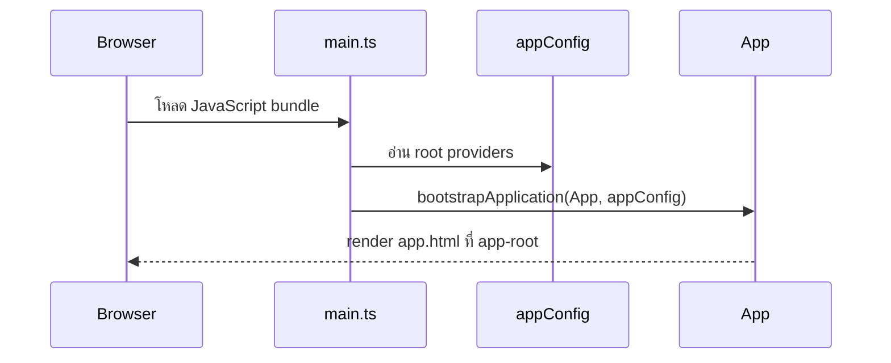

Angular CLI สร้างไฟล์ startup หลายไฟล์แทนการรวมทุกอย่างไว้ใน `main.ts` การแยกนี้ทำให้ root component สนใจ UI ขณะที่ application config สนใจ provider ของทั้งแอป บทนี้อ่าน flow นั้นก่อนเปลี่ยนหน้า setup ให้เป็น application shell

## เป้าหมายของบท

หลังจบบท หน้า browser จะมี `header`, `main`, `footer` และหัวข้อ `Product Catalog` คุณจะตาม startup flow ได้โดยไม่จำ configuration ทุกบรรทัด

## สิ่งที่ต้องพร้อม

- อยู่ใน directory `product-catalog-angular`
- บทที่ 3 ผ่าน `npm test -- --no-watch` และ `npm run build`
- `src/app/app.html` ยังเป็นหน้า setup จากท้ายบทที่ 3

## ไฟล์ที่อ่านและแก้

| ไฟล์ | การทำงานในบทนี้ |
| --- | --- |
| `src/main.ts` | อ่าน entry point ไม่แก้ |
| `src/app/app.config.ts` | อ่าน root providers ไม่แก้ |
| `src/app/app.routes.ts` | อ่าน routes ว่าง ไม่แก้ |
| `src/app/app.ts` | อ่าน root component ไม่แก้ |
| `src/app/app.html` | แทนที่ด้วย application shell |
| `src/app/app.spec.ts` | ปรับ test ให้ตรวจ shell |

## Startup flow



Browser โหลด bundle แล้วเริ่มที่ `main.ts` จากนั้น Angular สร้าง application environment, ลงทะเบียน providers และสร้าง root component

## ขั้นที่ 1: อ่าน entry point

เปิด `src/main.ts`:

```ts
import { bootstrapApplication } from '@angular/platform-browser';
import { appConfig } from './app/app.config';
import { App } from './app/app';

bootstrapApplication(App, appConfig).catch((err) => console.error(err));
```

`bootstrapApplication` รับ root component และ `ApplicationConfig` แล้วคืน Promise การใช้ `catch` ทำให้ startup failure ปรากฏใน Console แทนการหายไปเงียบ ๆ

Standalone bootstrap ไม่ได้แปลว่าแอปมี component เดียว แต่หมายถึงการเริ่ม application ไม่ต้องผ่าน root NgModule Component อื่นจะถูก import ตามขอบเขตที่ใช้งานในบทต่อไป

## ขั้นที่ 2: อ่าน root providers

เปิด `src/app/app.config.ts`:

```ts
import { ApplicationConfig, provideBrowserGlobalErrorListeners } from '@angular/core';
import { provideRouter } from '@angular/router';

import { routes } from './app.routes';

export const appConfig: ApplicationConfig = {
  providers: [provideBrowserGlobalErrorListeners(), provideRouter(routes)],
};
```

Provider บอก dependency injection system ว่าความสามารถใดพร้อมใช้ใน application environment:

- `provideBrowserGlobalErrorListeners()` เชื่อม browser errors ที่เกี่ยวข้องกับ Angular error handling
- `provideRouter(routes)` ลงทะเบียน Router ด้วย route configuration ของแอป

Provider ไม่ใช่สถานที่เก็บ product state และไม่ควรเรียก API โดยตรง `appConfig` มีหน้าที่ประกอบความสามารถระดับ root เท่านั้น

เปิด `src/app/app.routes.ts`:

```ts
import { Routes } from '@angular/router';

export const routes: Routes = [];
```

Routes ยังว่างเพราะเราจะสอน Router หลังเข้าใจ components และ reactive flow แล้ว การเตรียม provider ไว้ตอน scaffold ไม่ได้บังคับให้สร้าง routes ก่อนถึงบทที่ 17

## ขั้นที่ 3: อ่าน root component

เปิด `src/app/app.ts`:

```ts
import { Component } from '@angular/core';

@Component({
  selector: 'app-root',
  imports: [],
  templateUrl: './app.html',
  styleUrl: './app.css',
})
export class App {}
```

`@Component` เพิ่ม metadata ที่ Angular compiler ต้องใช้:

- `selector` ระบุตำแหน่ง host element ซึ่ง CLI ใส่ `<app-root>` ไว้ใน `src/index.html`
- `imports` ระบุ standalone dependencies ที่ template นี้ใช้ ตอนนี้ยังว่าง
- `templateUrl` และ `styleUrl` ชี้ไปยัง view และ component stylesheet

Class `App` ยังไม่มี state เพราะ shell ในบทนี้เป็น static HTML การไม่เพิ่ม state ก่อนมีพฤติกรรมที่ต้องจัดการช่วยให้ responsibility ของ component เริ่มต้นเรียบง่าย

## ขั้นที่ 4: สร้าง semantic application shell

แทนที่ `src/app/app.html` ด้วย:

```html
<header>
  <a href="/" aria-label="Product Catalog home">Product Catalog</a>
  <p>Angular 22 learning project</p>
</header>

<main>
  <section aria-labelledby="page-title">
    <p>Application shell</p>
    <h1 id="page-title">Product Catalog</h1>
    <p>โครงหลักของแอปพร้อมสำหรับเพิ่มรายการสินค้าในบทถัดไป</p>

    <h2>สิ่งที่จะสร้างต่อ</h2>
    <ul>
      <li>รายการและรายละเอียดสินค้า</li>
      <li>แบบฟอร์มเพิ่มและแก้ไขสินค้า</li>
      <li>การเชื่อม Product API และสถานะข้อผิดพลาด</li>
    </ul>
  </section>
</main>

<footer>
  <p>Product Catalog Angular</p>
</footer>
```

`header`, `main` และ `footer` สร้าง landmarks ให้ผู้ใช้และ assistive technology ส่วน `aria-labelledby` เชื่อม section กับ heading ที่อธิบายเนื้อหา ลิงก์ใช้สำหรับ navigation ส่วนคำสั่งที่เปลี่ยนข้อมูลในบทหลังจะใช้ button

เรายังไม่เพิ่ม CSS เพราะบทที่ 5 จะอธิบาย component styles และ style scoping ก่อนใช้

## ขั้นที่ 5: ปรับ test ให้ตรวจพฤติกรรมใหม่

ใน `src/app/app.spec.ts` แทนที่ test case ที่ตรวจ title ด้วย:

```ts
it('should render the application shell', async () => {
  const fixture = TestBed.createComponent(App);
  await fixture.whenStable();
  const compiled = fixture.nativeElement as HTMLElement;

  expect(compiled.querySelector('h1')?.textContent).toContain('Product Catalog');
  expect(compiled.querySelector('header')).toBeTruthy();
  expect(compiled.querySelector('main')).toBeTruthy();
  expect(compiled.querySelector('footer')).toBeTruthy();
});
```

Test อ่าน DOM เหมือนผู้ใช้เห็น จึงยังคงใช้ได้แม้ภายหลังเราเปลี่ยน implementation ภายในโดยไม่เปลี่ยน contract ของ shell

## Zoneless rendering ในสถานะปัจจุบัน

Shell นี้เป็น static HTML จึง render ครั้งแรกตอน bootstrap และยังไม่มี interaction ที่ต้อง schedule รอบใหม่ เมื่อเราเพิ่ม behavior Angular จะได้รับ notification จากแหล่งที่ชัดเจน เช่น template listener, Signal ที่ template อ่าน หรือ `AsyncPipe`

สิ่งที่ควรหลีกเลี่ยงคือเปลี่ยน object ภายในแบบที่ Angular ไม่ได้รับ notification แล้วเรียก `detectChanges()` ไปทั่วเพื่อกลบปัญหา หนังสือจะสอน state owner และ notification source ก่อนเพิ่ม state แต่ละชนิด

`--zoneless` ในบทที่ 3 ทำให้ workspace ไม่พึ่ง Zone.js ไม่ต้องเพิ่ม `provideZonelessChangeDetection()` เพราะ Angular 22 ใช้ zoneless เป็นค่าเริ่มต้น และไม่ควรเพิ่ม `provideZoneChangeDetection()` ซึ่งจะเปลี่ยน architecture กลับไปเป็น Zone.js

## ขั้นที่ 6: ตรวจผล

รัน tests และ build ก่อน:

```bash
npm test -- --no-watch
npm run build
```

จากนั้นเปิด development server:

```bash
npm start
```

เปิด URL ที่ CLI แสดงจริงและตรวจที่ viewport ปกติของ browser:

- มีข้อความ `Product Catalog` เป็น heading ระดับ 1 เพียงหนึ่งจุด
- Elements panel มี `header`, `main` และ `footer`
- Console ไม่มี uncaught error
- Network panel โหลด document และ JavaScript bundles สำเร็จ
- refresh แล้วยังเห็น shell เดิม

หยุด server ด้วย `Ctrl+C`

## ปัญหาที่พบบ่อย

### Browser ยังแสดงหน้า setup ของบทที่ 3

ตรวจว่าแก้ `src/app/app.html` ใน workspace ที่กำลังรัน และ terminal แสดง rebuild สำเร็จ หากมีหลาย workspace ให้ตรวจ current directory ก่อนรัน `npm start`

### Test หา `Product Catalog setup complete`

Assertion เก่ายังไม่ได้เปลี่ยน ให้แก้ test ให้ตรวจ heading และ semantic landmarks ใหม่ ไม่ควรเปลี่ยนกลับไปให้ UI ตรงกับ test เก่า

### ขึ้น `NG05104` หรือหา `app-root` ไม่พบ

ตรวจว่า `selector: 'app-root'` ใน `app.ts` ตรงกับ `<app-root>` ใน `src/index.html` Host element เป็นจุดที่ Angular นำ root component ไปวาง

### เพิ่ม Router outlet แล้วหน้าเปล่า

Routes ยังว่างและบทนี้ยังไม่ต้องใช้ `RouterOutlet` ให้นำ code ที่ข้ามมาจากบท Router ออกก่อน เพื่อรักษา progressive state ของบท 4

## แบบฝึกหัด

ใช้คำพูดของคุณอธิบาย startup flow ตั้งแต่ browser โหลด bundle จนเห็น `<h1>` แล้วเพิ่ม `<nav aria-label="Primary">` ที่มีลิงก์ Home หนึ่งรายการ ตรวจว่า heading order และ landmarks ยังสมเหตุสมผล โดยยังไม่เพิ่ม RouterLink

## Checkpoint

บทนี้ผ่านเมื่อ:

- อธิบายหน้าที่ของ `main.ts`, `app.config.ts`, `app.routes.ts` และ `app.ts` แยกกันได้
- บอกได้ว่า provider ต่างจาก application state อย่างไร
- tests และ production build ผ่าน
- browser แสดง semantic shell และ Console ไม่มี error
- ยกตัวอย่าง zoneless notification source ได้อย่างน้อยสองชนิด

Snapshot อ้างอิงหลังจบบทอยู่ที่ `examples/progressive/chapter-04`
