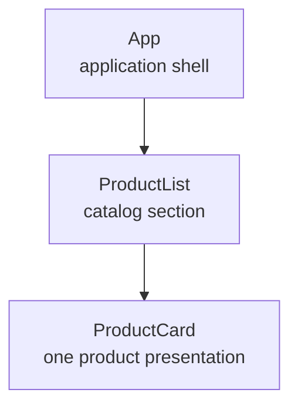

Application shell ในบทที่ 4 ยังรวมเนื้อหาทั้งหน้าไว้ใน root component ถ้าเราเพิ่มรายการสินค้า แบบฟอร์ม และสถานะต่าง ๆ ลงในไฟล์เดียว `App` จะต้องรับผิดชอบหลายเรื่องเกินไป บทนี้จะแยก UI ตามหน้าที่ก่อนเพิ่มข้อมูลแบบ dynamic

## เป้าหมายของบท

หลังจบบท หน้า browser จะประกอบจาก component tree สามระดับ:



Product ยังเป็น static markup โดยตั้งใจ เราจะเรียน interpolation และ event binding ในบทที่ 6 แล้วจึงสร้าง input/output contracts ในบทที่ 7 การแยก component ก่อนมี state ทำให้เห็น boundary โดยไม่ต้องเรียนหลายแนวคิดพร้อมกัน

## สิ่งที่ต้องพร้อม

- อยู่ใน directory `product-catalog-angular`
- บทที่ 4 ผ่าน `npm test -- --no-watch` และ `npm run build`
- หน้า browser มี semantic shell และหัวข้อ `Product Catalog`
- `src/app/app.ts` ยังมี `imports: []`

## ไฟล์ที่สร้างและแก้

| ไฟล์ | การทำงานในบทนี้ |
| --- | --- |
| `src/app/product-card/product-card.ts` | metadata และ class ของการ์ดสินค้า |
| `src/app/product-card/product-card.html` | static product markup |
| `src/app/product-card/product-card.css` | style เฉพาะ view ของการ์ด |
| `src/app/product-list/product-list.ts` | import `ProductCard` |
| `src/app/product-list/product-list.html` | section ที่ประกอบการ์ด |
| `src/app/product-list/product-list.css` | layout ของ product section |
| `src/app/app.ts` | import `ProductList` |
| `src/app/app.html` | แสดง `<app-product-list />` |
| `src/app/app.css` | style ของ application shell |
| `src/styles.css` | document defaults ระดับ global |
| `src/app/app.spec.ts` | ตรวจ component composition |

## Component, host และ view

Angular component มีส่วนสำคัญสามอย่าง:

1. TypeScript class เป็นตำแหน่งของ behavior ซึ่งยังว่างในบทนี้
2. Template กำหนด DOM ที่ component render
3. Selector เป็นชื่อ element ที่ parent ใช้วาง component

เมื่อ template ของ parent มี `<app-product-card />` element นี้คือ **host element** ส่วน DOM จาก `product-card.html` ที่ Angular render ภายใน host คือ **view** ของ `ProductCard`

Standalone component ไม่ต้องประกาศใน NgModule แต่ dependency ที่ template ใช้ต้องอยู่ใน `imports` ของ component นั้นอย่างชัดเจน

## ขั้นที่ 1: สร้าง components ด้วย CLI

รันคำสั่งจาก root ของ `product-catalog-angular` คำสั่งเหมือนกันใน PowerShell และ Bash:

```bash
npx ng generate component product-card --skip-tests --defaults
npx ng generate component product-list --skip-tests --defaults
```

เราใช้ local CLI ผ่าน `npx` เพื่อให้ตรงกับเวอร์ชันใน lockfile และใช้ `--skip-tests` เพราะบทที่ 24 จะสอน component tests โดยตรง ตอนนี้ root integration test ที่มีอยู่จะตรวจ composition ให้ก่อน

CLI สร้าง class, template และ stylesheet แยกไฟล์ ตัวอย่าง `src/app/product-card/product-card.ts`:

```ts
import { Component } from '@angular/core';

@Component({
  selector: 'app-product-card',
  imports: [],
  templateUrl: './product-card.html',
  styleUrl: './product-card.css',
})
export class ProductCard {}
```

`templateUrl` และ `styleUrl` อ้าง path เทียบจากไฟล์ component ส่วน class ยังว่างเพราะ view นี้ยังไม่มี state หรือ behavior

## ขั้นที่ 2: สร้าง ProductCard view

แทนที่ `src/app/product-card/product-card.html` ด้วย:

```html
<article class="product-card" aria-labelledby="featured-product-name">
  <p class="product-card__category">Office</p>
  <h3 id="featured-product-name">Mechanical Keyboard</h3>
  <p class="product-card__description">
    คีย์บอร์ดขนาดกะทัดรัดสำหรับโต๊ะทำงานและการเขียนโค้ด
  </p>

  <dl class="product-card__facts">
    <div><dt>Price</dt><dd>฿2,490</dd></div>
    <div><dt>Stock</dt><dd class="product-card__status">In stock</dd></div>
  </dl>
</article>
```

`article` ทำให้การ์ดเป็นเนื้อหาที่อยู่ได้ด้วยตัวเอง และ `aria-labelledby` เชื่อม article กับชื่อสินค้า ข้อมูล price/stock ใช้ description list เพราะเป็นคู่ label-value

ใส่ style ส่วนโครงใน `src/app/product-card/product-card.css`:

```css
:host {
  display: block;
}

.product-card {
  padding: 1.5rem;
  border: 1px solid #cbd5d1;
  border-radius: 6px;
  background: #ffffff;
  box-shadow: 0 8px 24px rgb(23 32 30 / 8%);
}

.product-card__category {
  margin: 0 0 0.5rem;
  color: #8a351d;
  font-size: 0.8rem;
  font-weight: 800;
  text-transform: uppercase;
}

h3 {
  margin: 0;
  font-size: 1.35rem;
}
```

จากนั้นต่อท้ายไฟล์เดียวกันด้วย style ของรายละเอียด:

```css
.product-card__description {
  margin: 0.75rem 0 1.25rem;
  color: #52615d;
  line-height: 1.65;
}

.product-card__facts {
  display: grid;
  grid-template-columns: repeat(2, minmax(0, 1fr));
  gap: 1rem;
  margin: 0;
  padding-top: 1rem;
  border-top: 1px solid #e1e7e4;
}

.product-card__facts div { display: grid; gap: 0.25rem; }
dt { color: #687772; font-size: 0.8rem; }
dd { margin: 0; font-weight: 700; }
.product-card__status { color: #087f72; }
```

`:host` เลือก `<app-product-card>` ไม่ใช่ element ภายใน template ส่วน selector `h3` ถูก scope ด้วย default emulated encapsulation จึงไม่เปลี่ยน heading ใน component อื่น

## ขั้นที่ 3: ให้ ProductList ประกอบ ProductCard

แก้ `src/app/product-list/product-list.ts` ให้ import class ทั้งในภาษา TypeScript และ metadata:

```ts
import { Component } from '@angular/core';
import { ProductCard } from '../product-card/product-card';

@Component({
  selector: 'app-product-list',
  imports: [ProductCard],
  templateUrl: './product-list.html',
  styleUrl: './product-list.css',
})
export class ProductList {}
```

TypeScript `import` ทำให้ไฟล์รู้จัก class ส่วน `imports: [ProductCard]` ทำให้ Angular compiler อนุญาต selector ของ component นี้ใน template ทั้งสองจุดมีหน้าที่ต่างกันและต้องมีครบ

แทนที่ `src/app/product-list/product-list.html` ด้วย:

```html
<section class="product-list" aria-labelledby="product-list-title">
  <header class="product-list__header">
    <div>
      <p>Catalog preview</p>
      <h2 id="product-list-title">Products</h2>
    </div>
    <p>1 product</p>
  </header>

  <div class="product-list__grid">
    <app-product-card />
  </div>
</section>
```

ใส่ style ใน `src/app/product-list/product-list.css`:

```css
:host { display: block; }

.product-list {
  padding: 1.5rem;
  border: 1px solid #d7dfdc;
  border-radius: 8px;
  background: #eef2f0;
}

.product-list__header {
  display: flex;
  align-items: end;
  justify-content: space-between;
  gap: 1rem;
  margin-bottom: 1rem;
}

.product-list__header p { margin: 0; color: #52615d; font-size: 0.875rem; }
h2 { margin: 0.25rem 0 0; font-size: 1.65rem; }
.product-list__grid { display: grid; gap: 1rem; }

@media (max-width: 32rem) {
  .product-list { padding: 1rem; }
}
```

ProductList เป็นเจ้าของ layout ของรายการ แต่ไม่ควรเข้าถึง element ภายใน ProductCard เพื่อบังคับรายละเอียดการ์ด แต่ละ component ดูแล view ของตัวเอง

## ขั้นที่ 4: เชื่อม ProductList เข้ากับ App

แก้ `src/app/app.ts`:

```ts
import { Component } from '@angular/core';
import { ProductList } from './product-list/product-list';

@Component({
  selector: 'app-root',
  imports: [ProductList],
  templateUrl: './app.html',
  styleUrl: './app.css',
})
export class App {}
```

แทนที่ `src/app/app.html` ด้วย shell ที่วาง child component:

```html
<header class="app-header">
  <div>
    <a class="brand" href="/" aria-label="Product Catalog home">Product Catalog</a>
    <p>Angular 22 learning project</p>
  </div>
  <span class="chapter-label">Chapter 05</span>
</header>

<main class="app-main">
  <section class="page-intro" aria-labelledby="page-title">
    <p class="eyebrow">Catalog workspace</p>
    <h1 id="page-title">Product Catalog</h1>
    <p>จัดการข้อมูลสินค้าอย่างเป็นระบบผ่าน component ที่มีหน้าที่ชัดเจน</p>
  </section>
  <app-product-list />
</main>

<footer class="app-footer"><p>Product Catalog Angular</p></footer>
```

Style ของ shell มีรายละเอียดมากกว่าแนวคิด Angular ของบทนี้ ให้แทนที่ `src/app/app.css` ด้วยไฟล์จากสองส่วนต่อไปนี้ เริ่มจาก layout:

```css
:host { display: block; min-height: 100dvh; background: #f5f7f6; color: #17201e; }

.app-header, .app-main, .app-footer {
  width: min(100% - 2rem, 70rem);
  margin-inline: auto;
}

.app-header {
  display: flex;
  align-items: center;
  justify-content: space-between;
  gap: 1rem;
  padding-block: 1.25rem;
  border-bottom: 1px solid #cbd5d1;
}

.brand { color: #075e54; font-size: 1.125rem; font-weight: 700; text-decoration: none; }
.app-header p, .app-footer p { margin: 0.25rem 0 0; color: #52615d; }
```

ต่อท้ายด้วย typography และระยะห่าง:

```css
.chapter-label {
  padding: 0.35rem 0.6rem;
  border: 1px solid #d66b48;
  border-radius: 4px;
  color: #8a351d;
  font-size: 0.875rem;
  font-weight: 700;
}

.app-main { padding-block: 3.5rem; }
.page-intro { max-width: 44rem; margin-bottom: 2.5rem; }
.eyebrow { margin: 0 0 0.5rem; color: #087f72; font-weight: 800; text-transform: uppercase; }
h1 { margin: 0; font-size: clamp(2rem, 8vw, 3.5rem); line-height: 1.05; }
.page-intro > p:last-child { margin: 1rem 0 0; color: #52615d; font-size: 1.05rem; }
.app-footer { padding-block: 1.25rem 2rem; border-top: 1px solid #cbd5d1; }

@media (max-width: 36rem) {
  .app-header { align-items: flex-start; }
  .chapter-label { white-space: nowrap; }
  .app-main { padding-block: 2.5rem; }
}
```

## ขั้นที่ 5: แยก global styles

แทนที่ `src/styles.css` ด้วย document defaults ที่ทุก component ใช้ร่วมกัน:

```css
* { box-sizing: border-box; }

html {
  font-family: Inter, system-ui, sans-serif;
  background: #f5f7f6;
}

body { margin: 0; }

button, input, select, textarea {
  font: inherit;
}
```

Global stylesheet เหมาะกับ reset, font และ design tokens ที่ทั้งแอปใช้ร่วมกัน ส่วน style ที่รู้จักโครงสร้างภายในของ ProductCard ต้องอยู่กับ component นั้น

## ขั้นที่ 6: ปรับ integration test

ใน test `should render the application shell` ของ `src/app/app.spec.ts` เพิ่ม assertions ก่อนปิด test:

```ts
expect(compiled.querySelector('app-product-list')).toBeTruthy();
expect(compiled.querySelector('app-product-card')).toBeTruthy();
expect(compiled.querySelector('article h3')?.textContent).toContain('Mechanical Keyboard');
```

Test นี้ตรวจผลลัพธ์ที่ compose เสร็จแล้ว ไม่อ่าน private field และไม่ทดสอบจำนวนครั้งของ lifecycle hook

## ขั้นที่ 7: ตรวจผล

รัน tests และ production build:

```bash
npm test -- --no-watch
npm run build
```

จากนั้นเปิด development server:

```bash
npm start
```

เปิด URL ที่ CLI แสดงจริง แล้วตรวจ:

- เห็น heading `Product Catalog`, section `Products` และการ์ด `Mechanical Keyboard`
- Elements panel แสดง `app-root` มี `app-product-list` และภายในมี `app-product-card`
- ที่ viewport กว้างประมาณ 390px ไม่มี horizontal scroll
- Console ไม่มี `NG8001`, uncaught error หรือ warning จาก template
- refresh แล้วยังเห็น component tree เดิม

หยุด server ด้วย `Ctrl+C`

## ปัญหาที่พบบ่อย

### `NG8001: 'app-product-card' is not a known element`

ตรวจว่า `ProductList` มีทั้ง TypeScript import และ `imports: [ProductCard]` Angular ไม่ค้นหา standalone component จากชื่อ selector โดยอัตโนมัติ

### สร้าง component ผิด workspace

ถ้า CLI แจ้งว่าอยู่นอก workspace หรือไฟล์ไปอยู่ผิด directory ให้ตรวจว่า terminal อยู่ที่ root ของ `product-catalog-angular` ก่อนรัน `npx ng generate`

### CSS ของ ProductCard ไม่เปลี่ยน heading ใน App

นี่เป็นผลที่ถูกต้องของ emulated style encapsulation `h3` ใน `product-card.css` ถูก scope ให้ view ของ ProductCard ไม่ใช่ global CSS

### แสดงเพียงสินค้าเดียวและข้อความยังเปลี่ยนไม่ได้

สถานะนี้ถูกต้องสำหรับบท 5 ข้อมูลยังเป็น static เพื่อโฟกัส component composition บท 6 จะย้ายข้อความไปเป็น properties และเพิ่ม binding โดยไม่ต้องรื้อ component tree

## แบบฝึกหัด

เพิ่ม `h1 { color: #d66b48; }` ชั่วคราวใน `product-card.css` แล้วเปิด browser สังเกตว่า `<h1>` ใน App ไม่เปลี่ยนสี จากนั้นลบ rule นี้และอธิบายว่า style scoping ป้องกันการรั่วข้าม component boundary อย่างไร

## Checkpoint

บทนี้ผ่านเมื่อ:

- อธิบาย class, selector, host element, template และ view แยกกันได้
- อธิบายได้ว่าทำไม standalone component ต้องอยู่ใน `imports` ของ parent
- บอกได้ว่า style ใดควรเป็น global และ style ใดควรอยู่กับ component
- tests และ production build ผ่าน
- browser แสดง component tree สามระดับโดยไม่มี console error หรือ horizontal overflow
- ยังไม่มี Signals, inputs/outputs, Router หรือ HTTP code ก่อนบทที่สอน

Snapshot อ้างอิงหลังจบบทอยู่ที่ `examples/progressive/chapter-05`
